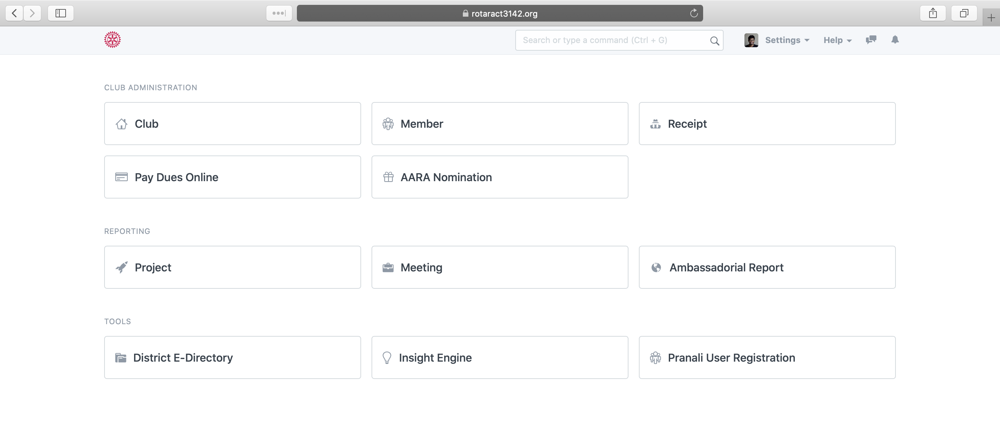

## Pranali Reloaded

A ERP system for Rotaract District Organisations build using the [Frappé Framework](https://frappeframework.com/)!



#### Set-up

Step #1: Refer to the README.md from [this link](https://github.com/frappe/bench) and install the Frappe bench.

Step #2: Once you've set up your bench, go to the folder using the Terminal and type 
```bench get-app https://github.com/RotaractIndia/pranali_reloaded```

Step #3: Press Enter

Step #4: Type
```bench install-app pranali_reloaded```

Step #5: Press Enter

#### Learn Frappe

To learn more about Frappe, consult their [documentation](https://frappe.io/docs/user/en)!

#### License

GNU General Public License v3

Made with ❤️  for Rotaract District Organisations by [@neillasrado](https://github.com/neilLasrado)
